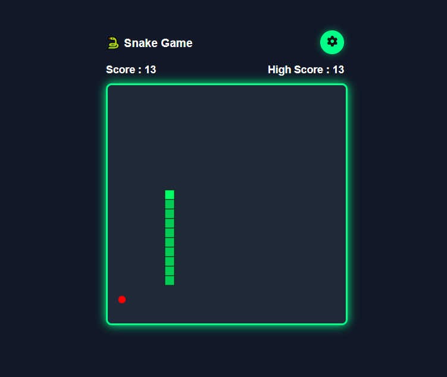
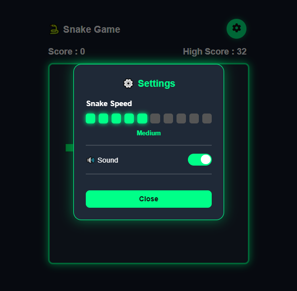
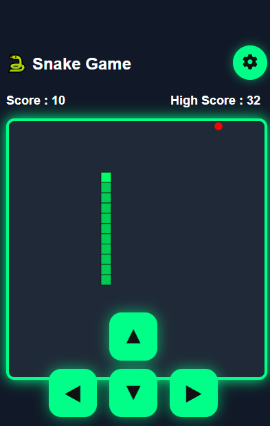

# 🐍 Snake Game

A modern and responsive Snake Game built using **HTML**, **CSS**, and **JavaScript**.

## 🌐 Live Demo

🔗 **Play Now:**  
https://saurav56295.github.io/snake-game/

---

# 📸 Screenshots

## 🏠 Home Screen



---

## 🎮 Gameplay


---

## ⚙️ Settings Panel



---

## 📱 Mobile View



---

# ✨ Features

- 🐍 Classic Snake Gameplay
- 🌍 Wrap Around Walls (No Wall Collision)
- 🍎 Red Food (+1 Score)
- 🔵 Blue Bonus Food (+5 Score)
- ⏱️ Bonus Food disappears after 5 seconds
- ⚙️ Adjustable Snake Speed
- 🟩 Speed Indicator Blocks
- 🔊 Sound Toggle
- 📱 Mobile Touch Controls
- ⌨️ Keyboard Controls
- ⏸️ Pause / Resume
- 🏆 High Score Saved using Local Storage
- 📱 Fully Responsive Design

---

# 🎮 Controls

| Key | Action |
|------|--------|
| ⬆️ Arrow | Move Up |
| ⬇️ Arrow | Move Down |
| ⬅️ Arrow | Move Left |
| ➡️ Arrow | Move Right |
| Space | Pause / Resume |

**Mobile Users**

Use the on-screen arrow buttons to control the snake.

---

# 🛠️ Built With

- HTML5
- CSS3
- JavaScript (ES6)
- HTML5 Canvas
- Local Storage

---

# 📂 Project Structure

```text
snake-game/
│
├── assets/
│   ├── Home.png
│   ├── Gameplay.png
│   ├── Settings.png
│   └── Mobileview.png
│
├── index.html
├── style.css
├── script.js
├── README.md
└── LICENSE
```

---

# 🚀 Future Improvements

- 🎵 Background Music
- 🌙 Dark Mode
- 🏆 Online Leaderboard
- 🏅 Achievements
- 🎯 Difficulty Levels
- 👥 Multiplayer Mode

---

# 👨‍💻 Author

**Saurav Ram**

- GitHub: https://github.com/Saurav56295

---

# ⭐ Show Your Support

If you enjoyed this project, please consider giving it a ⭐ on GitHub.

It helps others discover the project and motivates further improvements.